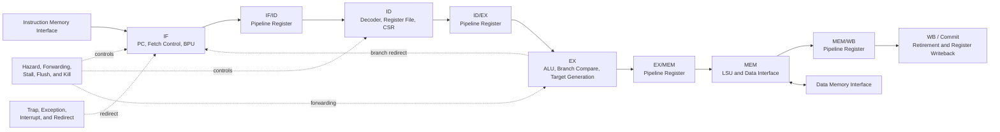

# RV32I CPU — Sky130A RTL-to-GDSII


[](https://github.com/Zhungg/rv32i-cpu-openlane/actions/workflows/rtl-ci.yml)


A modular five-stage, in-order RISC-V RV32I CPU implemented in SystemVerilog and taken through an open-source Sky130A RTL-to-GDSII flow using OpenLane 2.

The project covers:

```text
Specification
→ RTL design
→ Unit and integration verification
→ SystemVerilog-to-Verilog conversion
→ Yosys synthesis readiness
→ OpenLane 2 physical implementation
→ MCMM static timing analysis
→ DRC, LVS, and antenna verification
→ Reproducible engineering release
```

## Release Status

The current engineering release is **v1.0.0**.

| Item                           |   Result |
| ------------------------------ | -------: |
| RTL implementation             | Complete |
| Frontend and core verification |     PASS |
| Generated RTL reproducibility  |     PASS |
| Yosys synthesis readiness      |     PASS |
| OpenLane 2 RTL-to-GDSII flow   | Complete |
| MCMM setup timing              |      MET |
| MCMM hold timing               |      MET |
| Antenna verification           |     PASS |
| LVS                            |     PASS |
| DRC                            |     PASS |
| Independent clean-clone audit  |     PASS |

## Design Overview

The design is organized as a modular five-stage CPU pipeline:



### Main RTL Areas

* **Frontend:** program counter, instruction fetch, branch prediction infrastructure, BTB, PHT, and global history.
* **Decode:** instruction decoder, immediate generation, and register file.
* **Execute:** ALU, branch comparison, and branch-target generation.
* **Memory:** load/store unit, alignment handling, memory transactions, and fence control.
* **Pipeline:** IF/ID, ID/EX, EX/MEM, and MEM/WB pipeline registers.
* **Control:** hazards, data forwarding, stalls, flushes, and pipeline kills.
* **Commit:** writeback and architectural retirement.
* **Trap infrastructure:** CSR, exception, interrupt, trap entry, and return handling.
* **SoC infrastructure:** memory wrappers and address decoding.

## Physical-Design Signoff

The v1.0.0 release is based on the following signoff run:

| Metric               |                    Result |
| -------------------- | ------------------------: |
| Design               |              `rv32i_core` |
| PDK                  |                   Sky130A |
| Physical-design flow |                OpenLane 2 |
| Clock port           |                   `clk_i` |
| Clock period         |               `20.000 ns` |
| Target frequency     |                  `50 MHz` |
| Final run            | `RUN_2026-07-23_18-56-04` |
| Worst setup WNS      |            `+0.252381 ns` |
| Worst setup corner   |        `max_ss_100C_1v60` |
| Worst hold WNS       |            `+0.254094 ns` |
| Worst hold corner    |        `min_ff_n40C_1v95` |
| Setup status         |                       MET |
| Hold status          |                       MET |
| Antenna              |                      PASS |
| LVS                  |                      PASS |
| DRC                  |                      PASS |

Selected signoff evidence is available in:

```text
reports/signoff/
```

The raw OpenLane run directory is intentionally excluded from Git because it contains large generated and intermediate artifacts.

## Repository Structure

```text
rv32i-cpu-openlane/
├── config/                     # RTL file lists and shared configuration
├── docs/                       # Architecture and microarchitecture documents
├── rtl/
│   ├── pkg/                    # Types, constants, and shared packages
│   ├── core/                   # Core top level and datapath integration
│   ├── frontend/               # Fetch and branch-prediction logic
│   ├── decode/                 # Decoder and register file
│   ├── execute/                # ALU and branch execution
│   ├── memory/                 # LSU and memory-interface logic
│   ├── pipeline/               # Pipeline registers
│   ├── control/                # Hazard and forwarding control
│   ├── commit/                 # Writeback and retirement
│   ├── trap/                   # CSR, exception, and interrupt logic
│   └── soc/                    # SoC wrapper and memory subsystem
├── tb/
│   ├── common/                 # Shared verification utilities
│   ├── unit/                   # Unit-level self-checking testbenches
│   ├── core/                   # Core-level verification
│   ├── memory_models/          # Behavioral memory models
│   └── programs/               # Assembly and test programs
├── scripts/                    # Build, verification, and flow automation
├── synth/yosys/                # Standalone synthesis support
├── sta/opensta/                # Standalone STA support
├── openlane/
│   ├── rv32i_core/             # OpenLane configuration for the CPU core
│   └── rv32i_soc/              # OpenLane directory for the SoC wrapper
├── reports/
│   ├── signoff/                # Final selected signoff reports
│   └── github_release_audit/   # Release and reproducibility evidence
└── Makefile                    # Main project entry points
```

More information is available in [`PROJECT_STRUCTURE.md`](PROJECT_STRUCTURE.md).

## Verification

The project provides unit-level and integration-level regression targets for the CPU datapath and control subsystems.

Representative targets include:

```bash
make test-leaf-datapath
make test-decoder
make test-execute-support
make test-pipeline-registers
make test-frontend-baseline
make test-baseline-core
make test-lsu-core
make test-load-use-hazard
make test-forwarding-core
make test-basic-trap
make test-csr-instructions
make test-bpu-fetch-integration
make test-step7-regression
```

Check the complete target list with:

```bash
make help
```

or inspect the project `Makefile`.

## Reproducing the Release Checks

### 1. Clone the repository

```bash
git clone https://github.com/Zhungg/rv32i-cpu-openlane.git
cd rv32i-cpu-openlane
git checkout v1.0.0
```

### 2. Verify the project structure

```bash
make check-structure
```

### 3. Verify the release source manifest

```bash
sha256sum -c reports/signoff/source_manifest.sha256
```

### 4. Regenerate the flattened OpenLane RTL

The generation flow requires `sv2v`:

```bash
make generate-openlane-rtl
```

The regenerated file is:

```text
openlane/rv32i_core/src/rv32i_core.v
```

### 5. Run the frontend baseline

```bash
make test-frontend-baseline
```

### 6. Check Yosys synthesis readiness

This step requires both `sv2v` and Yosys:

```bash
make check-yosys-synthesis-readiness
```

## Running OpenLane 2

### Requirements

* Docker
* OpenLane 2 image
* Sky130A PDK installed through Volare
* `PDK_ROOT` pointing to the local PDK installation

The project defaults are:

```text
OpenLane image: ghcr.io/efabless/openlane2:2.3.10
PDK:            sky130A
PDK_ROOT:       $HOME/.volare
```

Generate the OpenLane-compatible RTL:

```bash
make generate-openlane-rtl
```

Run the core implementation:

```bash
export PDK_ROOT="$HOME/.volare"
export PDK="sky130A"

make openlane-core
```

OpenLane-generated runs are written under:

```text
openlane/rv32i_core/runs/RUN_<timestamp>/
```

These run directories are intentionally ignored by Git.

## Signoff and Release Evidence

Important release files include:

* [`reports/signoff/final_signoff_summary.txt`](reports/signoff/final_signoff_summary.txt)
* [`reports/signoff/mcmm_timing_summary.txt`](reports/signoff/mcmm_timing_summary.txt)
* [`reports/signoff/manufacturability.rpt`](reports/signoff/manufacturability.rpt)
* [`reports/signoff/worst_setup_path_summary.txt`](reports/signoff/worst_setup_path_summary.txt)
* [`reports/signoff/source_manifest.sha256`](reports/signoff/source_manifest.sha256)
* [`reports/github_release_audit/step4/clean_clone_audit_summary.txt`](reports/github_release_audit/step4/clean_clone_audit_summary.txt)

## Engineering Release

The v1.0.0 release was prepared using the following workflow:

```text
Source audit
→ controlled release branch
→ generated RTL reproducibility check
→ tracked-artifact audit
→ independent clean clone
→ pull-request review
→ squash merge
→ annotated Git tag
→ GitHub Release
→ tagged-release verification
```

Release tag:

```text
v1.0.0
```

Release commit:

```text
0159bac669248c784cd492941cd068c4a258517b
```

## Scope and Limitations

This repository is an educational and engineering portfolio project focused on digital IC design, verification, and ASIC Physical Design methodology.

The reported signoff status refers to the open-source Sky130A/OpenLane 2 implementation flow. It does not represent fabricated-silicon validation or production qualification.

## Author

**Nguyễn Việt Hùng**

Electronics and Telecommunications student pursuing ASIC Physical Design and Digital IC Design.

## Citation

Citation metadata for this project is available in [`CITATION.cff`](CITATION.cff).
GitHub can use this file to generate APA and BibTeX citations.


## License

The original material in this repository is licensed under the
[Apache License 2.0](LICENSE).

External tools, PDK files, standard-cell libraries, specifications, and
third-party material remain subject to their respective licenses. See
[`THIRD_PARTY_NOTICES.md`](THIRD_PARTY_NOTICES.md).

