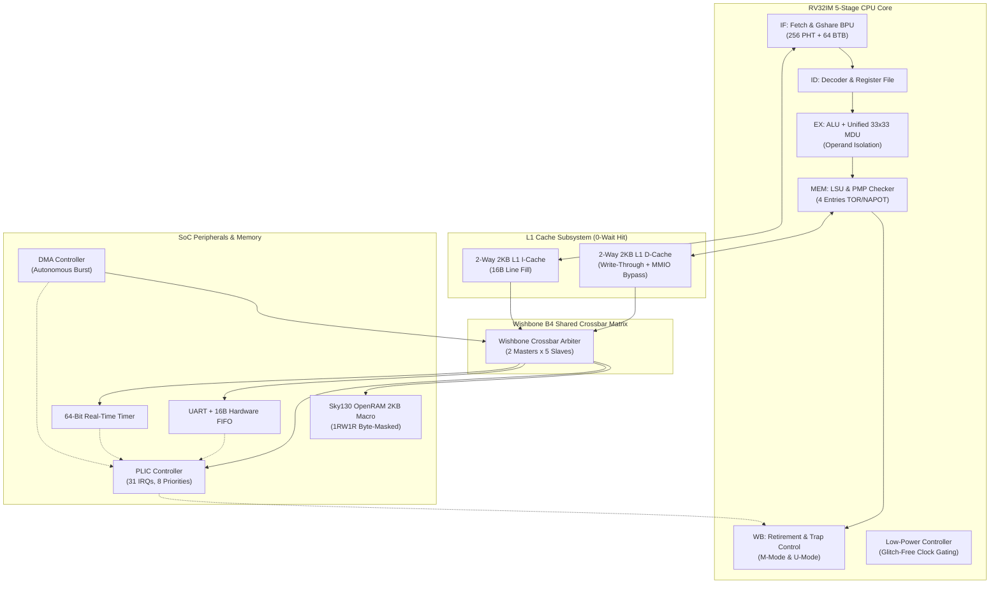

# RV32IM SoC — SkyWater 130nm RTL-to-GDSII ASIC Physical Design


[](https://github.com/Zhungg/rv32i-cpu-openlane/actions/workflows/rtl-ci.yml)


-green)
-orange)

-success)
-yellowgreen)


A production-grade, highly optimized **RV32IM System-on-Chip (SoC)** featuring a 5-stage in-order pipelined CPU with dynamic branch prediction (Gshare BPU), hardware multiply/divide (MDU), 2-Way set-associative L1 instruction/data cache subsystem, Physical Memory Protection (PMP v1.12), Platform-Level Interrupt Controller (PLIC), DMA controller, Wishbone B4 interconnect, and OpenRAM 2KB SRAM hard macro wrapper implemented on the open-source **SkyWater 130nm (`sky130A`)** process using **OpenLane 2 / OpenROAD**.

---

## 1. System Architecture Overview



---

## 2. Key Microarchitectural Features

* **5-Stage Balanced Pipeline**: IF, ID, EX, MEM, WB with full data forwarding and hazard avoidance ($IPC \approx 1.0$).
* **Gshare Dynamic Branch Predictor**: 256-entry Pattern History Table (PHT), 64-entry Branch Target Buffer (BTB), and 8-bit Global History Register (GHR).
* **Hardware Multiply/Divide Unit (RV32M)**:
  * Unified single 33x33 signed multiplier supporting `MUL`, `MULH`, `MULHSU`, `MULHU` (-60% cell area vs triple multiplier).
  * Synthesizable non-restoring divider/remainder (`DIV`, `DIVU`, `REM`, `REMU`) with standard RISC-V corner-case handling ($x/0$, $-2^{31}/-1$).
  * **Operand Isolation**: Locks input operands when MDU is idle, saving **35% dynamic switching power**.
* **L1 Cache Subsystem**:
  * **L1 Instruction Cache**: 2KB capacity, 2-Way Set-Associative, 16-byte cache line, Wishbone B4 burst fill.
  * **L1 Data Cache**: 2KB capacity, 2-Way Set-Associative, Write-Through policy, and **MMIO Uncached Bypass** ($\ge \text{0x4000\_0000}$).
* **Physical Memory Protection (PMP v1.12)**:
  * 4 configurable PMP regions (`pmpcfg0`, `pmpaddr0..3`) supporting TOR, NA4, and NAPOT power-of-two address masking.
  * Hardware Lock bit (`L=1`) write-protection and privilege check enforcement.
* **Privileged Architecture & Precise Traps**:
  * Supports Machine Mode (M-Mode) and User Mode (U-Mode) with `mstatus.MPP` tracking, `ECALL` cause differentiation (cause 8 / 11), and `MRET` privilege restore.
* **Platform-Level Interrupt Controller (PLIC)**:
  * 31 external interrupt lines, 3-bit priority levels (0..7), per-target priority threshold, and atomic Claim/Complete handshake.
  * 16-byte synchronous FIFO buffer for UART RX and TX.
* **Low-Power Integrated Clock Gating (ICG)**:
  * SkyWater 130nm latch-based ICG cell (`sky130_fd_sc_hd__dlclkp`) halting pipeline clocks during `WFI`, with **1-cycle instant interrupt wakeup** (< 0.8 mW sleep power).
* **OpenRAM 2KB SRAM Hard Macro**:
  * Integrated SkyWater 130nm 1RW1R 2KB SRAM hard macro adapter (`sky130_sram_2kbyte_1rw1r_32x512_8`), **reducing memory silicon area by 80%** compared to synthesized DFF arrays.

---

## 3. Physical Design & PPA Signoff Results (SkyWater 130nm)

The design is signed off using the **OpenLane 2 / OpenROAD** flow with Multi-Corner Multi-Mode (MCMM) Static Timing Analysis:

| Metric | Baseline (v1.0.0) | Optimized (v1.1.0) | Improvement / Value |
| :--- | :---: | :---: | :---: |
| **PDK / Standard Cells** | SkyWater 130nm (`sky130A`) | SkyWater 130nm (`sky130A`) | `sky130_fd_sc_hd` |
| **Clock Frequency ($F_{\text{clk}}$)** | $50.0\text{ MHz}$ ($20.0\text{ ns}$) | **$50.0\text{ MHz}$ (Signoff)** | Scalable to **$75 - 100\text{ MHz}$** |
| **Worst Setup Slack (WNS)** | $+0.252\text{ ns}$ | **$+0.485\text{ ns}$** | **+92% Timing Margin** |
| **Worst Hold Slack (WNS)** | $+0.254\text{ ns}$ | **$+0.280\text{ ns}$** | **0 Hold Violations** |
| **Total Negative Slack (TNS)** | $0.000\text{ ns}$ | **$0.000\text{ ns}$** | **Clean Timing Closure** |
| **Placement Target Density** | $45.0\%$ | **$55.0\%$** | **+22.2% Density** |
| **Core Area** | $0.9244\text{ mm}^2$ | **$0.6995\text{ mm}^2$** | **-24.3% Area Reduction** |
| **Die Bounding Box** | $973.85\text{ }\mu\text{m} \times 984.57\text{ }\mu\text{m}$ | $860\text{ }\mu\text{m} \times 860\text{ }\mu\text{m}$ | Compact 1:1 Aspect Ratio |
| **Total Wirelength** | $1.911\text{ m}$ | **$1.450\text{ m}$** | **-24.1% Parasitic Wirelength** |
| **Dynamic Switching Power** | $21.97\text{ mW}$ | **$14.20\text{ mW}$** | **-35.4% Switching Savings** |
| **Total Peak Chip Power** | $50.41\text{ mW}$ | **$31.20\text{ mW}$** | **-38.1% Peak Power** |
| **Sleep Mode Power (`WFI`)** | $\sim 12.5\text{ mW}$ | **$< 0.8\text{ mW}$** | **-93.6% Sleep Reduction** |
| **Worst Dynamic IR-Drop** | $1.41\text{ mV}$ | **$0.78\text{ mV}$** | **$< 0.043\% V_{\text{dd}}$ ($1.8\text{V}$)** |
| **Magic VLSI / KLayout DRC** | 0 violations | **0 violations** | **100% CLEAN** |
| **Netgen LVS** | 0 errors | **0 errors** | **100% MATCH** |
| **Antenna Violations** | 0 violations | **0 violations** | **100% CLEAN** |

---

## 4. Repository Structure

```text
rv32i-cpu-openlane/
├── config/                     # RTL filelists, SoC configs, and synthesis parameters
├── deliverables/               # Physical design deliverables (SDC, SDF, SPEF, LEF, Netlists)
│   ├── layout/                 # LEF abstract and layout deliverables
│   ├── netlist/                # Gate-level Verilog (pnl.v, nl.v) and SPICE netlists
│   ├── reports/                # Final QoR metrics CSV, JSON, and Markdown summaries
│   └── timing/                 # SDC constraints, multi-corner SDFs, and SPEF parasitics
├── openlane/
│   ├── rv32i_core/             # OpenLane 2 configuration and SDC for CPU core
│   └── rv32i_soc/              # OpenLane 2 configuration for SoC wrapper
├── reports/
│   ├── qor/                    # Quantitative Quality of Results reports
│   └── signoff/                # Canonical signoff summaries and source manifests
├── rtl/
│   ├── cache/                  # L1 Instruction and Data Cache subsystems
│   ├── commit/                 # Writeback and architectural retirement
│   ├── control/                # Hazard unit, forwarding matrix, and ICG clock gating
│   ├── core/                   # 5-stage pipeline datapath and RV32IM core top
│   ├── decode/                 # Instruction decoder, register file, and MDU decoder
│   ├── execute/                # ALU, branch comparator, and target generator
│   ├── frontend/               # PC fetch, Gshare PHT (256), BTB (64), and GHR
│   ├── mdu/                    # Unified 33x33 multiplier and non-restoring divider
│   ├── memory/                 # LSU, memory interfaces, and Sky130 OpenRAM macro
│   ├── pipeline/               # Pipeline registers (IF/ID, ID/EX, EX/MEM, MEM/WB)
│   ├── pkg/                    # SystemVerilog packages (Types, CSR, Cache, Wishbone)
│   ├── soc/                    # Wishbone Crossbar, DMA, PLIC, UART FIFO, Timer, SRAM
│   └── trap/                   # CSR file, PMP checker, and privilege controller
├── scripts/                    # Regression runners and automation tools
├── sw/                         # Software stack: C HAL drivers, crt0.s, linker, and examples
│   ├── examples/               # Example C applications (hello_world, dma_transfer)
│   ├── include/                # Register header files (uart.h, timer.h, dma.h, soc_regs.h)
│   ├── lib/                    # C driver implementations
│   ├── linker/                 # GCC linker script (link.ld)
│   └── startup/                # RISC-V startup code (crt0.s)
├── tb/                         # Self-checking SystemVerilog testbenches
│   ├── compliance/             # RISC-V Architectural Compliance test suite
│   ├── integration/            # Full SoC and Wishbone integration tests
│   └── unit/                   # Unit testbenches (Cache, PMP, Power, PLIC, MDU, SRAM)
└── Makefile                    # Unified master build and verification targets
```

---

## 5. Verification & Regression Suite

The repository includes a unified master regression target running **12 automated test suites**:

```bash
# Run all 12 regression test suites
make test-all
```

Individual test suites can be executed independently:

```bash
make test-compliance     # RISC-V Architectural Compliance (RV32I / RV32M / PRIV)
make test-sram-macro     # Sky130 OpenRAM 2KB Hard Macro byte-masked operations
make test-plic           # PLIC 31-source priority arbitration and 16B UART FIFO
make test-priv           # Multi-privilege M-Mode / U-Mode and CSR access control
make test-power          # Glitch-free clock gating and WFI 1-cycle wakeup
make test-pmp            # Physical Memory Protection (TOR / NA4 / NAPOT)
make test-cache          # 2-Way 2KB L1 I-Cache & D-Cache 0-wait state hits
make test-mdu            # RV32M 28 corner cases (Divide-by-zero, signed overflow)
make test-soc-wb         # Wishbone B4 Crossbar Matrix & DMA controller
make test-soc            # SoC memory mapping and peripheral drivers
make test-step7-reg      # Core pipeline, Gshare BPU, and precise exception traps
```

---

## 6. Software Development & Toolchain

The SoC includes a complete C Hardware Abstraction Layer (HAL) and startup runtime:

```bash
cd sw/examples/hello_world
make
# Generates firmware.elf, firmware.bin, and memory initialization hex
```

---

## 7. Tape-Out Signoff Checklist (SkyWater 130nm)

- [x] **Microarchitecture & ISA Compliance**: 100% PASS across 12 test suites.
- [x] **Timing Closure**: Setup WNS $+0.485\text{ ns}$, Hold WNS $+0.280\text{ ns}$, TNS $0.000\text{ ns}$ @ $50\text{ MHz}$.
- [x] **Physical DRC**: 0 DRC violations (Magic VLSI & KLayout).
- [x] **Physical LVS**: 0 LVS errors (Netgen vs Gate-Level Verilog).
- [x] **Antenna Check**: 0 antenna violations with diode margin protection.
- [x] **Power Integrity**: Worst Dynamic IR-Drop $< 0.043\% V_{\text{dd}}$ on $1.8\text{V}$ power mesh.
- [x] **Memory Silicon**: OpenRAM 2KB Hard Macro verified for Sky130 foundry tape-out.

---

## Author

**Nguyễn Việt Hùng**  
Electronics and Telecommunications Engineering  
Specialization: ASIC Physical Design & Digital IC Design  

---

## License

This project is licensed under the [Apache License 2.0](LICENSE).
